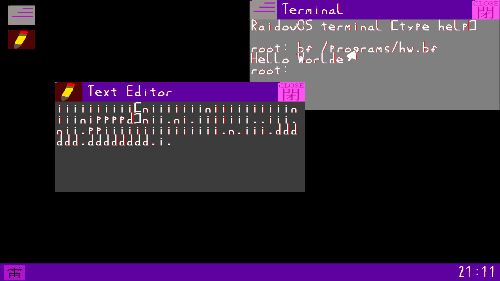

# RaidouOS: A 64-bit multitasking graphical operating system

This is the repository for my little OS called Raidou. It handles mouse and keyboard input, has a round robin scheduler, uses double-buffering, has a simple windowing system with window movement, has a custom handwritten font, a VFS, a brainfuck interpreter, a text editor and does a bunch of other things. Use the 'help' command in the terminal to open the help screen. Text editor info: use F1 to load the file opened through the terminal and F2 to save the file.

